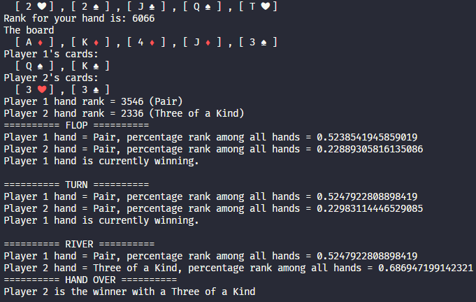

# deuces.js


A Node.JS port of [deuces](https://github.com/worldveil/deuces) poker hand evaluation library.



## Installation
```npm install --save deuces.js```

```yarn add deuces.js```

## Usage
Feel free to take a look in the example file in ```test/go.js```

```javascript
const { Card, Deck, Evaluator, LookupTable } = require("deuces.js");

// Create a new card
const card = Card.newCard("Qh"); // Queen of Hearts

// Create a hand of Queen of Spades and Ten of Hearts
const hand = [
    Card.newCard("Qs"),
    Card.newCard("Th")
];

const board = [
     Card.newCard("Ah"),
     Card.newCard("Kd"),
     Card.newCard("Jc")
];

// Instantiate an Evaluator to evaluate the results
const evaluator = new Evaluator();
const rank = evaluator.evaluate(board, hand)
console.log(`Rank for your hand is: ${rank}`);


// Create a Deck
const deck = new Deck();            // Create a new shuffled deck
board = deck.draw(5);               // Draw 5 cards from the deck
const player1_hand = deck.draw(2);  // player 1 will draw 2 cards
const player2_hand = deck.draw(2);  // player 2 will draw 2 cards


// Print out their drawn cards
Card.print_pretty_cards(board)
// > [ 2 ♦ ] , [ 2 ❤ ] , [ K ♣ ] , [ J ♣ ] , [ 9 ❤ ]
Card.print_pretty_cards(player1_hand)
// > [ 5 ♦ ] , [ 2 ♣ ]
Card.print_pretty_cards(player2_hand)
// > [ 7 ♠ ] , [ 7 ❤ ]


// Now let's evaluate their weights and see who's the winner
p1_score = evaluator.evaluate(player1_hand, board)
p2_score = evaluator.evaluate(player2_hand, board)

p1_class = evaluator.get_rank_class(p1_score)
p2_class = evaluator.get_rank_class(p2_score)

console.log(`Player 1 hand rank = ${p1_score} (${evaluator.class_to_string(p1_class)})`)
console.log(`Player 2 hand rank = ${p2_score} (${evaluator.class_to_string(p2_class)})`)
// > Player 1 hand rank = 2414 (Three of a Kind)
// > Player 2 hand rank = 3206 (Two Pair)


// To get a more in-depth explanation
const hands = [player1_hand, player2_hand]
evaluator.hand_summary(board, hands)
/*
========== FLOP ==========
Player 1 hand = Three of a Kind, percentage rank among all hands = 0.6756901634950415
Player 2 hand = Two Pair, percentage rank among all hands = 0.5703564727954972
Player 1 hand is currently winning.

========== TURN ==========
Player 1 hand = Three of a Kind, percentage rank among all hands = 0.6764942374698473
Player 2 hand = Two Pair, percentage rank among all hands = 0.5703564727954972
Player 1 hand is currently winning.

========== RIVER ==========
Player 1 hand = Three of a Kind, percentage rank among all hands = 0.6764942374698473
Player 2 hand = Two Pair, percentage rank among all hands = 0.5703564727954972
========== HAND OVER ==========
Player 1 is the winner with a Three of a Kind
*/
```

## Todo
- Add colors to suits
- Camelcasing functions

## Credits
- [worldveil/deuces](https://github.com/worldveil/deuces)

# License
Copyright (c) 2020 Shaun
